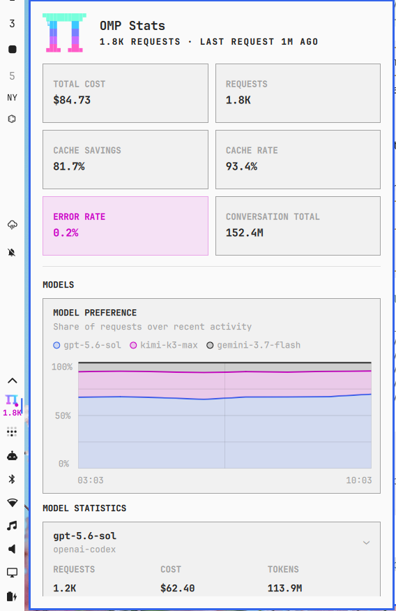
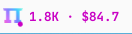

# OMP Stats

A native Omarchy Quattro bar widget for the local [`omp stats`](https://github.com/can1357/oh-my-pi) report.

The bar shows live request and cost totals. Its popup condenses OMP's Overview and Models views without scraping sessions or maintaining a second statistics database.

## Preview

### Panel and vertical bar



### Horizontal bar



The screenshots use synthetic usage data and contain no account or session information.

## Features

- Compact request and cost totals in horizontal and vertical bars
- Canonical OMP terminal Pi logo and compact Pi bar mark
- Cost, request, token, cache, error-rate, and performance summaries
- Model request-share, request-trend, TTFT, and tokens-per-second graphs
- Expandable model details plus project, agent-type, and recent-activity breakdowns
- Live Omarchy colors, fonts, spacing, and light/dark theme changes
- Configurable bar metric and 60–3600 second refresh interval
- Last valid report remains visible when a refresh fails

## Requirements

- Omarchy Quattro with third-party `bar-widget` support
- Bash
- OMP with `omp stats --json` support; verified with OMP 17.3.7

The bundled bridge resolves OMP in this order:

1. `OMP_BIN`, when explicitly set
2. `omp` on `PATH`
3. `mise which omp`
4. OMP releases under the active mise data directory

No fixed home directory, plugin directory, OMP version, `jq`, or Python package is required.

## Install

```bash
omarchy plugin add https://github.com/dylanmccavitt/omarchy-omp-stats.git --enable
```

The manifest places the widget in the right bar section by default. Move it when desired:

```bash
omarchy bar move io.github.dylanmccavitt.omp-stats --section right
```

## Update

```bash
omarchy plugin update io.github.dylanmccavitt.omp-stats
```

## Configure

The Omarchy bar settings expose:

- **Bar display:** `Requests and cost`, `Requests`, `Cost`, or `Logo only`
- **Refresh interval:** 60–3600 seconds; default 300

Horizontal bars show requests and compact cost in the combined mode. Vertical bars show the request count beneath the Pi mark; the tooltip retains precise request and cost totals.

## Use

### Bar

- Left-click: open or close the panel
- Middle-click or right-click: refresh immediately

### Panel

- Click a model row: expand or collapse its performance details
- `G`: expand or collapse the first model and scroll to its details
- `M`: jump to the Models section
- `R` or `Enter`: refresh
- Arrow keys or `J`/`K`: scroll
- `Esc`: close

Shell lifecycle commands use the permanent plugin ID:

```bash
omarchy-shell shell summon io.github.dylanmccavitt.omp-stats '{}'
omarchy-shell shell hide io.github.dylanmccavitt.omp-stats
```

## Remove

```bash
omarchy plugin remove io.github.dylanmccavitt.omp-stats
```

Removal is handled by Omarchy: the widget is disabled before its Git checkout is removed.

## Data, permissions, and privacy

Omarchy plugins run unsandboxed with the current user's permissions. Review this repository before installation.

This plugin starts the bundled `bin/stats-json` bridge, which executes the local `omp stats --json` command and renders its aggregate response. The plugin itself does not:

- Read OMP credential files
- Read raw session files
- Store a second copy of usage data
- Make network requests
- Request elevated privileges, manage system services, or run install hooks

OMP may synchronize sessions or contact configured providers as part of its own normal behavior. That remains governed by OMP's configuration.

## Architecture

- `BarWidget.qml`: canonical Omarchy bar entry point, panel host, live metric, and IPC routes
- `Panel.qml`: popup lifecycle, report refresh, keyboard behavior, and Canvas graphs
- `Model.js`: report validation, formatting, grouping, and graph transforms
- `bin/stats-json`: dependency-free OMP discovery and JSON-output bridge
- `assets/omp-mark.svg`: compact OMP Pi mark used by the bar

The bar entry point loads `Panel.qml` and injects the bar, settings, anchor, and host identity. This matches Omarchy's published bar-widget and nested-panel contract.

## Develop and validate

From the repository root:

```bash
omarchy plugin validate .
node Model.test.js
bash stats-json.test.sh
qmllint -I "$OMARCHY_PATH/shell" BarWidget.qml Panel.qml
```

Runtime checks:

```bash
omp stats --json
omarchy plugin list --json
omarchy-shell shell summon io.github.dylanmccavitt.omp-stats '{}'
omarchy-shell shell hide io.github.dylanmccavitt.omp-stats
```

## Troubleshooting

### OMP is not found

Confirm the CLI is available to a non-interactive shell:

```bash
command -v omp
omp stats --json
```

If OMP lives outside `PATH` and mise, launch Omarchy Shell with `OMP_BIN` set to the executable's absolute path.

### Widget is missing

```bash
omarchy plugin validate ~/.config/omarchy/plugins/io.github.dylanmccavitt.omp-stats
omarchy plugin enable io.github.dylanmccavitt.omp-stats
omarchy restart shell
```

### Statistics do not update

Run `omp stats --json` directly. Authentication, synchronization, and malformed-report errors from OMP are surfaced in the panel without replacing its last valid report.

## Attribution

The Pi logo and gradient palette are adapted from Oh My Pi's MIT-licensed terminal branding. The bar and panel integration follows Omarchy's MIT-licensed Quattro plugin contract. Copyright notices are preserved in `LICENSE`.

Oh My Pi, Omarchy, and their marks belong to their respective owners. This community plugin is not affiliated with or endorsed by either project.

## License

MIT. See `LICENSE`.
